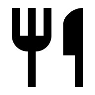

# HexForm
Form built on Final Form and Material UI components. Includes field-level validation, conditional rendering, reset button and submission via POST request.

## Preview

You can preview the form at [HexForm Website](https://krysiajanik.github.io/HexForm/)

## Project setup
    1. Open your command line and go to the directory in which you would like to set up the project.
    2. Clone the library by typing `git clone` and pasting the link https://github.com/krysiajanik/HexForm.git
    3. Run `npm install` to install the dependencies (make sure you have both node and npm installed)
    4. Once the packages are downloaded, run `npm run start` to start the development server at [http://localhost:3000](http://localhost:3000)

## Any questions or suggestions?
I'm always happy to learn and improve! So if you have any suggestions how to make the code better in any way, feel free to let me know!